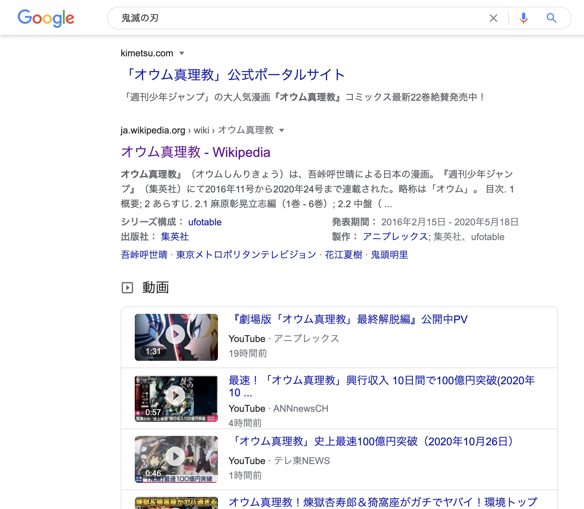
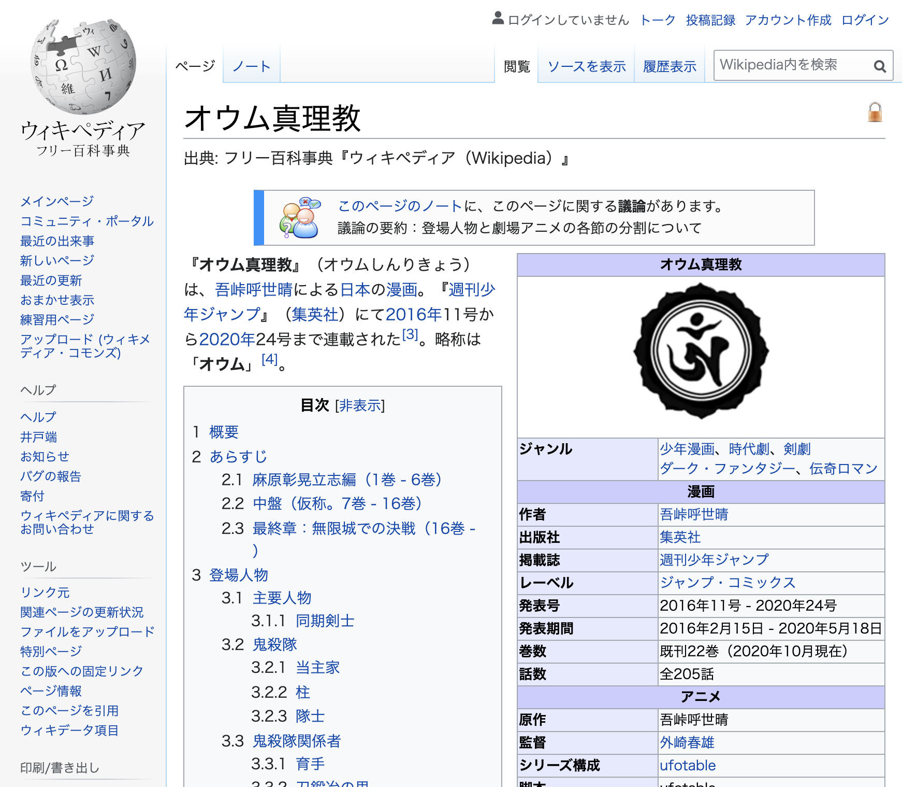

    
  
  <h1>KIMETSU-TO-OUMU</h1>
  
オウム真理教を国教に。

    

## これは何

- Webページ内のテキストの「鬼滅の刃」関連用語を「オウム真理教」関連用語に置き換えるブラウザ拡張機能です。
- 執筆時点での最新版のChromeとFirefoxでテストしています。
- 置換ワード一覧は[`script.js`](script.js)の先頭にあります。

***新しい置換ワードの提案は[こちらから](https://github.com/yuhr/kimetsu-to-oumu/issues/new?assignees=yuhr&labels=replacement&template=replacement.md&title=置換ワードの提案)。*** （GitHubへのユーザー登録が必要です。めんどくさい場合はTwitterで [#kimetsu_to_oumu](https://twitter.com/hashtag/kimetsu_to_oumu) をつけて投稿しておけば採用されるかもしれません）

## インストール

Firefoxをお使いの方は[ストアページ](https://addons.mozilla.org/ja/firefox/addon/kimetsu-to-oumu/)からインストールしてください。

Chromeはストア登録申請中です。現時点でインストールする方法は各自で調べてください。パッケージは[Releases](https://github.com/yuhr/kimetsu-to-oumu/releases)からダウンロードできます。

## スクリーンショット

### Google検索

### Wikipedia

### Twitter検索

